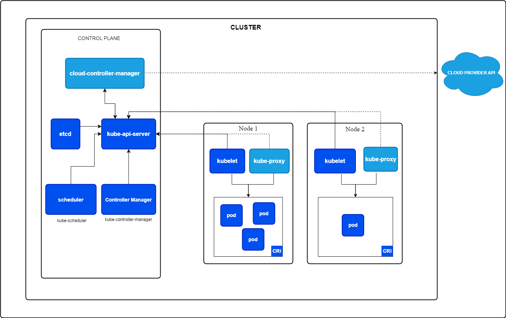

# 정의
* Kubernetes는 애플리케이션을 컨테이너 형태로 배포하고 관리하는 플랫폼
* 클러스터 내 다양한 구성 요소들이 협력하여 이를 자동화하여 쉽게게 배포할 수 있음

## **ETCD**
**클러스터 데이터를 저장하는 고가용성 키-값 저장소**
- **역할**
  - 클러스터 상태와 관련된 모든 정보를 저장함
  - 예: 어떤 컨테이너가 어느 노드에 배치되었는지, 클러스터 구성 데이터 등을 저장함.
- **특징**
  - 고가용성과 일관성을 보장하는 키-값 저장소로, 클러스터의 핵심 데이터베이스 역할을 수행함

## **Kube API Server**
**클러스터의 중앙 관리 구성 요소**
- **역할**
  - 클러스터 내 모든 작업을 조정함
  - 외부 사용자 및 클러스터 내부 구성 요소들과 통신함
- **기능**:
  - Kubernetes API를 노출하여 사용자가 클러스터를 관리할 수 있도록 지원함
  - 클러스터 상태를 모니터링하고, 필요한 변경 사항을 실행함

## **kube-scheduler**
**컨테이너 배치 담당**
- **역할**
  - 적절한 노드에 컨테이너를 배치함
  - 컨테이너의 리소스 요구사항, 노드의 용량, 정책(taints, tolerations, affinity 등)을 고려하여 배치 결정을 수행함
- **중요성**
  - 클러스터 자원을 효율적으로 사용하고, 컨테이너 간의 균형을 유지함

## **Controller Manager**
**클러스터 상태 유지**
- **Node Controller**
  - 새로운 노드를 클러스터에 추가하거나, 사용할 수 없는 노드를 처리함
- **Replica Controller**
  - 복제 그룹 내 원하는 수의 컨테이너가 항상 실행되도록 보장함
- **역할**: 클러스터의 특정 영역을 담당하며, 원하는 상태를 유지하기 위한 작업을 수행함.

## **워커 노드 구성 요소**
### **kubelet**
**노드 내 컨테이너 관리 에이전트**
- **역할**
  - Kube API Server로부터 명령을 수신함
  - 컨테이너를 배포하고 상태를 보고함
- **특징**: 각 노드에 설치되어 컨테이너 실행 및 관리를 담당함

### **kube-proxy
**네트워크 통신 담당**
- **역할**
  - 클러스터 내 컨테이너 간 통신을 가능하게 하는 네트워크 설정을 관리함
  - 워커 노드에서 실행되며, 필요한 네트워크 규칙을 적용함

### **컨테이너 런타임 엔진**
- **필요성**
  - Kubernetes는 컨테이너를 실행하기 위한 런타임 엔진이 필요함
- **예시**: Docker, ContainerD, Rocket 등
- **특징**: 클러스터의 모든 노드(마스터 포함)에 설치되어 컨테이너를 실행함

